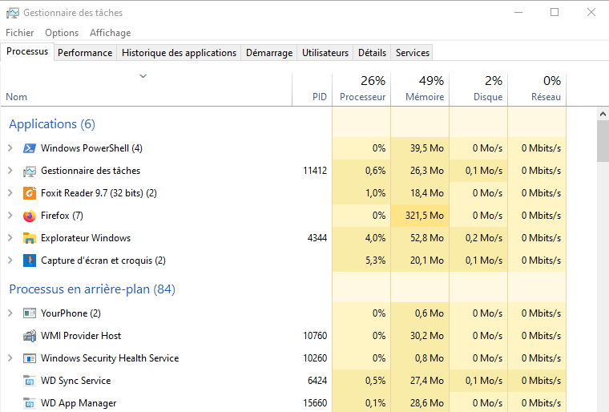

Systèmes d'exploitation
=======================

Chaque système d'exploitation gère les processus. Certaines différences apparaissent entre Windows et Linux.

Système d'exploitation windows
------------------------------

Pour visualiser les différents processus on utilise le **gestionnaire des taches** qui renseigne sur la quantité de mémoire et processeur utilisé par le processus. Il permet également de connaître le PID du processus.

Cette interface graphique permet d'arrêter facilement un processus par un clic droit et **fin de tache**.

Il est aussi possible de connaître les processus en ligne de commande mais l'interface graphique est plus conviviale.

Système d'exploitation Linux
----------------------------

Le système Linux a la particularité de pouvoir fonctionner sans passer par des interfaces graphiques. Pour afficher les processus et connaître leur état, on utilise la ligne de commandes dans un **shell** ou un **terminal**.

La commande ``ps`` affiche les processus en cours. 

.. admonition:: Exemple

	.. code-block:: bash

		ps

	La réponse du terminal :

	.. figure:: ../img/linux_ps.png
		:align: center
		:alt: linux_ps.png

Les processus affichés sont ceux de l'utilisateur. On peut noter comme information:

-  Le PID de chaque processus;
-  La console TTY actuellement utilisée
-  La commande (programme) CMD associé au processus
-  La colonne TIME indique la durée d'utilisation du processeur

Il faut reconnaître que l'information donnée est peu verbeuse. Ajoutons des options à la commande :

L'option ``ef`` permet de connaitre tous les processus sur toutes les consoles :

.. admonition:: Exemple

	.. code:: bash

		ps -ef

	On obtient l'affichage :

	.. figure:: ../img/linux_ps-ef.png
		:align: center
		:alt: linux_ps-ef.png

	.. figure:: ../img/linux_ps-ef2.png
		:align: center
		:alt: linux_ps-ef2.png

	On remarque 2 colonnes supplémentaires:

	-  La colonne UID qui indique l'utilisateur à l'origine du processus lancé
	-  La colonne STIME qui donne l'heure de lancement du processus

L'option ``eo`` permet de préciser les colonnes à afficher :

.. admonition:: Exemple

	.. code:: bash

		ps -eo pid,ppid,stat,command

	On obtient l'affichage :

	.. figure:: ../img/linux_ps-eo.png
		:align: center
		:alt: linux_ps-eo.png

	.. figure:: ../img/linux_ps-eo2.png
		:align: center
		:alt: linux_ps-eo2.png

	- la colonne STAT donne l'état du processus : S pour Sleep donc bloqué et R pour Run donc actif ou élu.
	- la colonne commande donne le programme associé au processus.

La commande top est léquivalent du gestionnaire de tâche de windows. En lui affectant des options, on peut sélectionner les affichages. C'est un affichage dynamique qui change toutes les 3 secondes.

L'option ``u`` permet de sélectionner l'utilisateur:

.. admonition:: Exemple

	.. code:: bash

		top -u utilisateur

	Cette commande provoque l'affichage suivant:
	
	.. figure:: ../img/linux_top.png
		:align: center
		:alt: linux_top.png