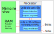
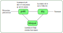

Les processus
=============

Un ordinateur est construit selon le **modèle d'architecture Von Neumann**. Les programmes sont chargés en mémoire et les instructions du programme sont envoyées au processeur qui les exécute. 

Les instructions d'un programme sont exécutées les unes après les autres. L'exécution du programme est prise en charge par le système d'exploitation qui :

-  charge les instructions du programme en mémoire vive;
-  écrit l'adresse mémoire de la première instruction dans le compteur de programme situé dans l'unité de contrôle du processeur;

Ensuite le processeur exécute les différentes instructions du programme qui ne sont pas nécessairement exécutées de façon continue par le processeur: on parle de **processus**. 

.. note::
	
	Un processus peut être interrompu, mis en pause pour permettre à d'autres processus de s'exécuter.

Sur un ordinateur, plusieurs programmes sont exécutés en même temps (dont les programmes propre au système d'exploitation). Pour chaque programme en cours d'exécution, un processus est créé.

-  Un premier processus est créé au démarrage du système d'exploitation. C'est le père de tous les autres processus lancés par la suite;
-  Chaque programme exécuté amène le système d'exploitation a créer un processus; Le système d'exploitation identifie chaque processus par un numéro unique : le **PID** acronyme de **Process Identifier**.
-  Un programme en cours d'exécution peut lancer un autre programme créant ainsi un nouveau processus. Ce deuxième processus est le fils du premier processus. Lorsqu'un processus engendre un fils, le système d'exploitation génère un nouveau numéro de processus pour le fils. Le fils connaît le PID de son père qui est le **PPID** acronyme de **Parent Process Identifier**.

Etats d'un processus
--------------------

Chaque processus suit un cycle de vie défini par le système d'exploitation. Un processus peut se trouver dans 3 états différents :

-  l'état **prêt** ce qui signifie qu'il est dans la file processus à exécuter.
-  l'état **élu** ce qui signifie qu'il est en cours d'exécution.
-  l'état **bloqué** c'est à dire en attente d'une ressource.

	
À la création d'un **processus** celui-ci est à l'état **prêt**.

Un processus se trouve dans l'un de ces trois états constituant son
cycle de vie. 

À la fin d'un processus, celui-ci est à l'état **terminé**.

Ordonnancement
--------------

Dans un système d'exploitation, plusieurs processus sont actifs simultanément, mais un processeur (simple coeur) ne peut exécuter qu’une instruction à la fois. Le système d'exploitation partage le temps de processeur entre tous les processus. **L'ordonnanceur** est chargé de cette gestion des processus.

De façon générale, **l'ordonnanceur** partage le processeur entre les différents processus; c'est un ordonnancement **préemptif**. Chaque processus se voit alloué un temps d'exécution pendant lequel il est à l'état **élu**. Ensuite le processus passe à l'état **prêt** et ainsi de suite.

- Le passage d'un processus de l'état **prêt** à l'état **élu** est appelé **election**.
- Le passage de l'état **élu** à l'état **prêt** est appelé **préemption**.  

.. image:: ../img/election_preemption.svg
	:align: center
	:alt: election_preemption.svg
	:width: 360
	:class: margine-bottom-8

Lorsque plusieurs processus sont créés, un seul est **élu**, les autres sont à l'état **prêt** ou à l'état **bloqué**. L'ordonnanceur, après un cycle d'exécution (quantum de temps), met le processus **élu** à l'état **prêt** et passe un autre processus de l'état **prêt** à **élu**.

On peut représenter les états des processus par un chronogramme.

.. image:: ../img/chronogramme_1.svg
	:align: center
	:alt: chronogramme_1.svg
	:width: 360
	:class: margin-bottom-8

Interblocage
------------

La plupart des ressources matérielles ne peuvent être utilisées que par un seul processus à la fois. Les systèmes d'exploitation ont des mécanismes pour contrôler l'utilisation des ressources par un seul processus. Un mécanisme répandu est l'utilsation d'un **verrou**.

- un processus demande un **verrou** pour utiliser une ressource.
- un processus relâche le **verrou** pour libérer la ressource.

Un processus qui demande un **verrou** sur une ressource est propriétaire du verrou et seul lui peut libérer la ressource en relâchant le verrou.

L\'**interblocage** est une situation dans laquelle les processus sont bloqués et ce sur un temps infini. L\'**interblocage** peut se produire lorsque des processus font appel à des ressources déjà utilisées par d'autres processus. Lorsqu'une ressource n'est pas disponible, le processus passe à l'état bloqué. Si aucune des ressources n'est libérée, les processus restent à l'état bloqué et créent un interblocage.

.. admonition:: Exemple

	Supposons 2 processus ayant besoin de deux ressources matérielles:

	-  Le processus 1 demande la ressource 1 avec un verrou
	-  Le processus 2 demande la ressource 2 avec un verrou
	-  Le processus 1 demande la ressource 2 avec un verrou; il passe à l'état bloqué car la ressource n'est pas disponible.
	-  Le processus 2 demande la ressource 1 avec un verrou; il passe à l'état bloqué car la ressource n'est pas disponible.

	Les deux processus restent à l'état bloqué. Il y a situation d'interblocage.

Les systèmes d'exploitation utilisent les verrous et des algorithmes d'ordonnancement pour éviter les situations d'interblocage. On peut citer deux
types de verrous:

- le **mutex** est un verrou qui n'autorise l'utilisation d'une ressource que par un seul processus à la fois.
- le **sémaphore** est un verrou qui autorise l'utilisation d'une ressource par un nombre fini de processus.
