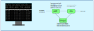

Processus
=========

Un programme exécuté sur un ordinateur crée un processus. Ce processus se trouve dans différents états jusqu'à la fermeture du programme. Les systèmes d'exploitations gèrent les processus pour que les programmes ne se bloquent pas mutuellement.

Gestion des processus et des ressources par un système d'exploitation.

- décrire la création d'un processus, l'ordonnancement de plusieurs processus par le système.
- mettre en évidence le risque d'interblocage (deadlock).

.. toctree::
   :maxdepth: 1
   :hidden:
   
   content/activite.rst
   content/processus.rst
   content/exercice.rst
   content/tp_os_processus.rst
   content/os_processus.rst
